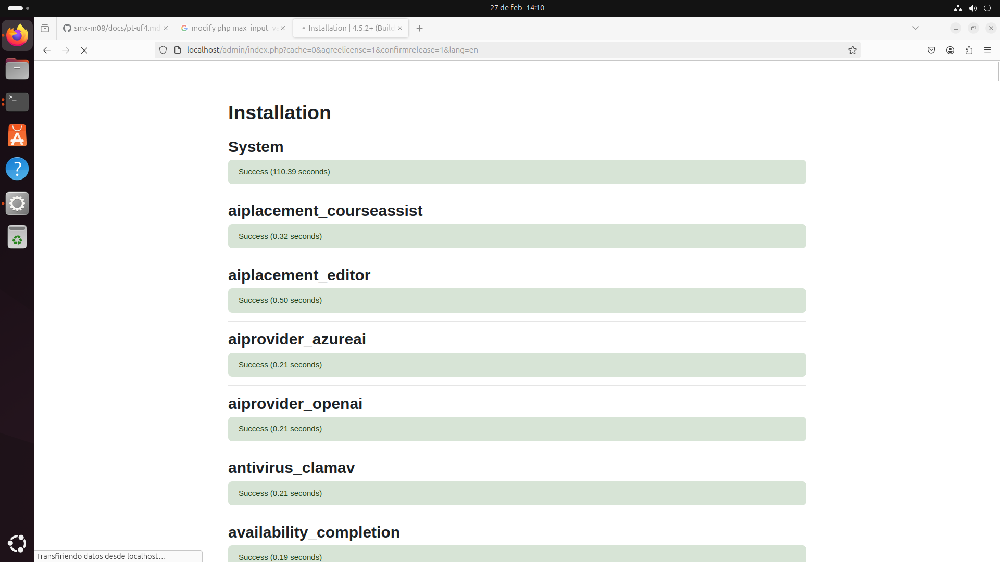
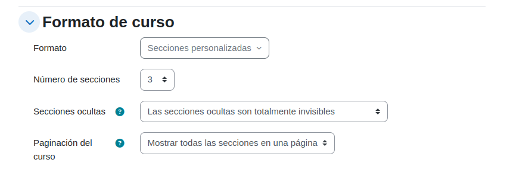
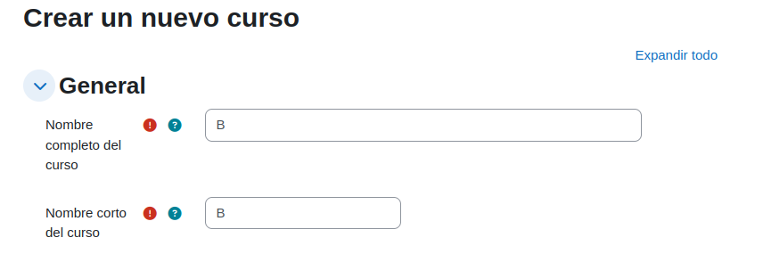
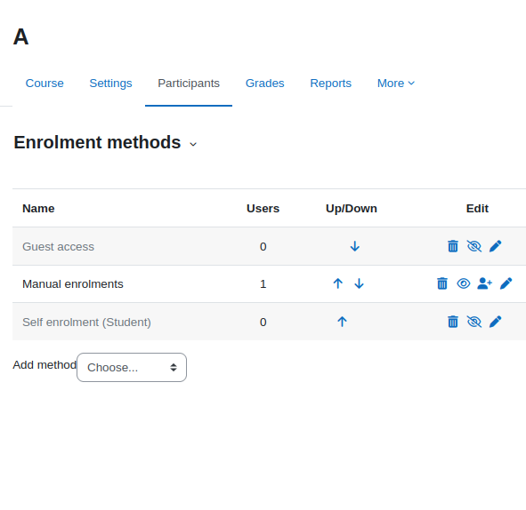
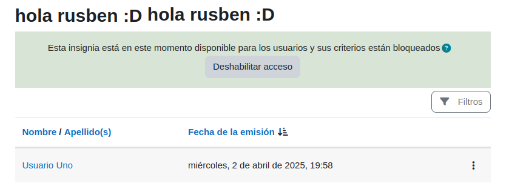

# Instal·lació i configuració de Moodle
En aquest repositori, s'explicarà com configurar el moodle i utilitzar funcions bàsiques, com la creació i matriculació d'usuaris, creació de cursos, etc.

## 1. Instal·lació de Moodle
1. Escollir l'idioma, configurar la base de dades i configurar els primers paràmetres de l'instal·lació.

## 2. Configuració
1. Canvia la direcció de correu electrònic, contrasenya, avatar, nom del lloc, que no es mostri res pels usuaris no autentificats i la franja horària.

2. Canvia l'idioma i la política de contrasenyes: ha de tenir com a mínim 4 caràcters incloent-hi majúscules, minúscules i xifres.

3. Crea un curs anomenat A format per 3 temes i el curs B format per 5 temes. A un dels cursos, fer que contingui material a un dels temes, canvia el títol d'un d'ells i afegfeix més coses.

4. Crea un usuari anomenat Bob que ha de fer servir l'autentificació manual, genera alumnes amb un arxiu CSV i elimina dos alumnes.

5. Fer que al curs A no hi hagi possibilitat d'inscripció, el curs B es necessiti registre manual, assignar a Bob com a professor del curs B i com a alumnes als de l'arxiu CSV. Comprova que el contingut del curs A estigui disponible públicament i que pel curs B s'hagi d'iniciar sessió amb un usuari registrat

6. Descarrega i activa un tema 

Vaig canviar a l'altre tema que venia per defecte ja que al ficar un nou tema, vaig haver d'esborrar tot el moodle.

7. Assigna un professor i matricula alumnes al curs A

8. Afegeix contingut al curs A, entre ells, una tasca que demani un fitxer PDF. Entra amb un alumne i comprova que es pot lliurar.

## Continguts
Crea una UF amb 2 NF dintre i crea activitats.

## Qualificació
Fes que un alumne completi totes les tasques evaluables, calificales amb el professor i configura el calificador per a que doni una nota de la UF automàticament. Crea una insignia i atorga-la a aquest alumne.

## Personalització
Canvia el logotip

## Seguretat

He aplicat aquestes opcions a la política de seguretat per garantir que ningú que no formi part del moodle pugui veure els perfils de la resta.
